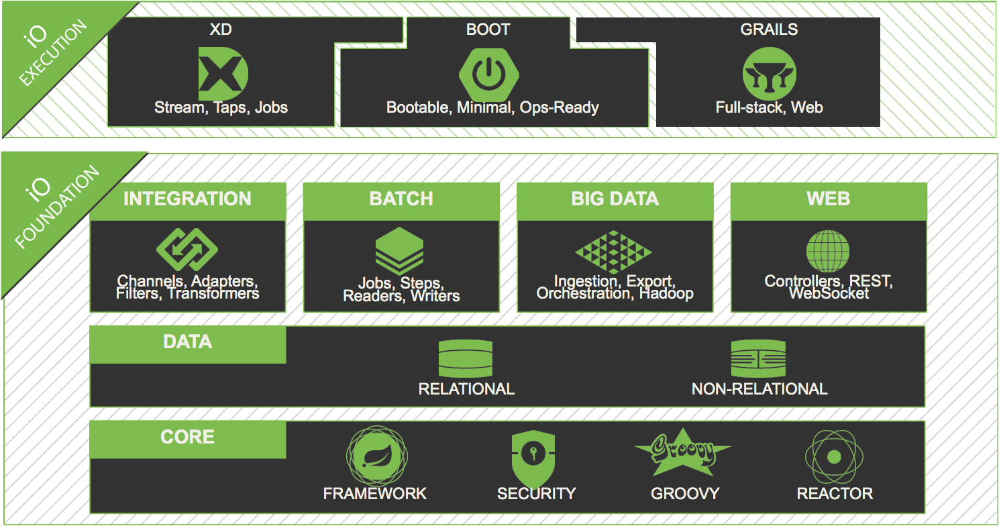

= Getting Started with Spring Security 3.2
@rob_winch
:backend: deckjs
:deckjs_theme: springone13
:deckjs_transition: horizontal-slide
:source-highlighter: prettify
:icons: font
:menu:

== About me

image::images/spring-security31-book.jpg[role="thumb right"]

* Open source fanatic
* Spring Security and Spring LDAP Project Lead
* Committer on Spring Framework
* Co-author of Spring Security 3.1 book
* Twitter @rob_winch

== Agenda

* What is Spring Security?
* What's new in Spring Security 3.2?
* Demo and live coding

== What is spring.io?

== What is Spring Security?

* Comprehensive support for Authentication and Authorization
* Protection against common attacks
* Servlet API integration
* Optional integration with Spring MVC
* Portability

== New in Spring Security 3.2
* Concurrency Support
* Servlet 3 and Servlet 3.1 integration
* Spring MVC integration
* CSRF protection
* Security header integration
* Java Configuration support

[canvas-image="images/security-demo.png"]
== Demo

== CSRF Protection

[source]
----
POST /sample/110 HTTP/1.1
Host: localhost:8080
Content-Type: application/x-www-form-urlencoded
Cookie: JSESSIONID=8B00C27E0962E363CBAC814F19E51C1D

_method=delete&_csrf=7d281f9f-55d9-4663-88f8-42827f3d2c12
----

== Security HTTP Response Headers

[source]
----
HTTP/1.1 200 OK
X-Content-Type-Options: nosniff
X-XSS-Protection: 1; mode=block
Cache-Control: no-cache, no-store, max-age=0, must-revalidate
Pragma: no-cache
Expires: 0
X-Frame-Options: DENY
Strict-Transport-Security: max-age=31536000 ; includeSubDomains
----

[canvas-image="images/security-demo.png"]
== Demo

== Learn More. Stay Connected.

* Sample Code http://github.com/rwinch/gs-spring-security-3.2
* Spring Security: http://spring.io/spring-security
* Twitter: @SpringSecurity / @rob_winch / @springcentral
* Find Talks on YouTube: http://spring.io/video