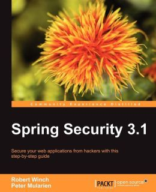

= Getting Started with Spring Security 3.2
@rob_winch
:backend: deckjs
:deckjs_theme: springone13
:deckjs_transition: horizontal-slide
:source-highlighter: prettify
:icons: font
:split:
:menu:
:pom: ../pom.xml
:sample-dir: ../src/main/java/sample
:user-predicates: {sample-dir}/data/UserPredicates.java
:test-sample-dir: ../src/test/java/test/sample
:user-repository-test: {test-sample-dir}/data/UserRepositoryTest.java
:jpa-message-repository: {sample-dir}/jpa/JpaMessageRepository.java
:data-message-repository: {sample-dir}/data/MessageRepository.java
:data-user-repository: {sample-dir}/data/UserRepository.java

== About me

* Open source fanatic
* Spring Security and Spring LDAP Project Lead
* Committer on Spring Framework
* Co-author of Spring Security 3.1 book
* Twitter @rob_winch

+

== Agenda

* What is Spring Security?
* What's new in Spring Security 3.2?
* Demo and live coding

== What is spring.io?

image::images/spring-io.png[]

== What is Spring Security?

* Comprehensive support for Authentication and Authorization
* Protection against common attacks
* Servlet API integration
* Optional integration with Spring MVC
* Portability

== New in Spring Security 3.2

* Servlet 3 and Servlet 3.1 integration
* Concurrency Support
* Spring MVC integration
* CSRF protection
* Security header integration
* Java Configuration support

== Demo

Demo Time!

== Learn More. Stay Connected.

* Sample Code http://github.com/rwinch/gs-spring-security-3.2
* Spring Security: http://spring.io/spring-security
* Twitter: @SpringSecurity / @rob_winch / @springcentral
* Find Talks on YouTube: http://spring.io/video